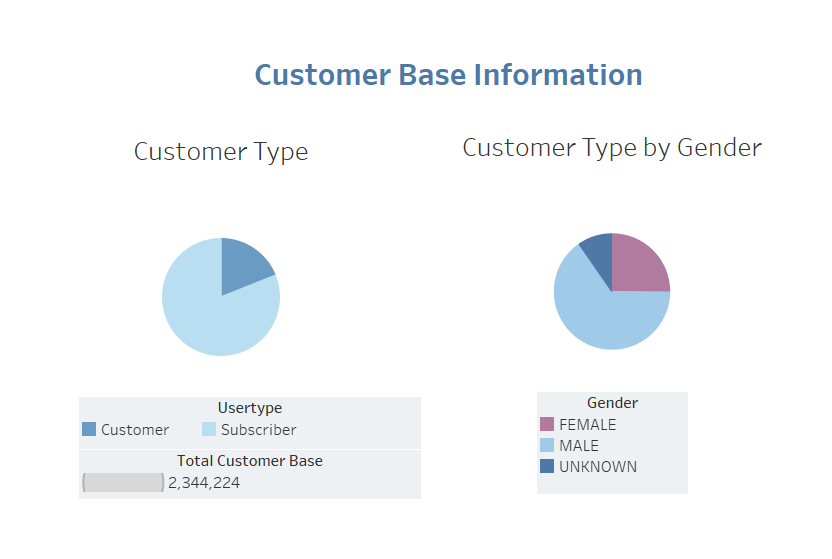
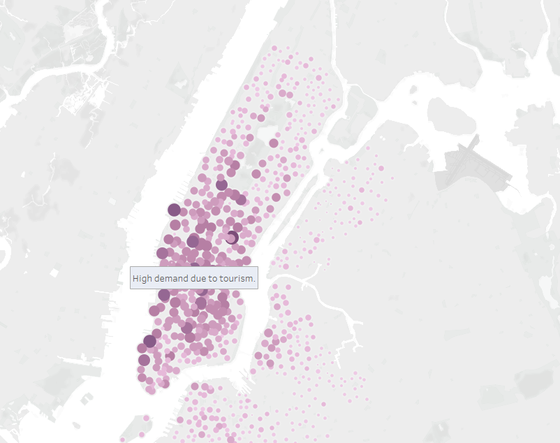
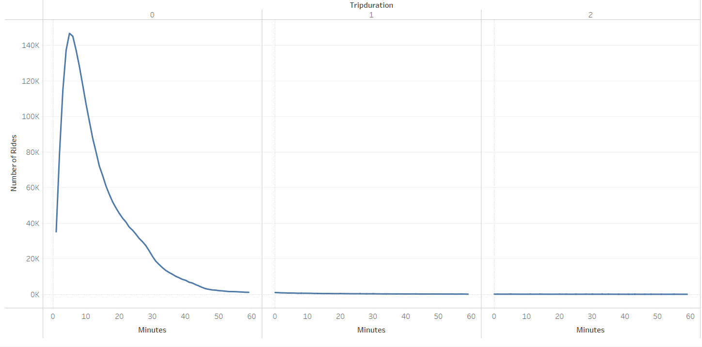
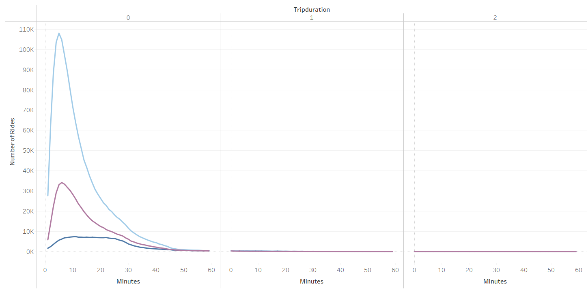
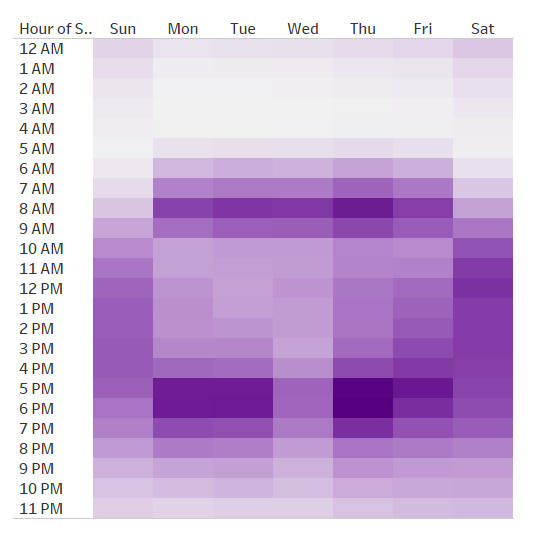
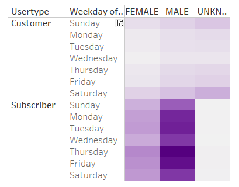

# Bikesharing Analysis in NYC

## Overview
This analysis has been prepared using Tableau, and can be viewed by following the [link](https://public.tableau.com/app/profile/kf3279/viz/NYCCitiBikeAnalysis_16550886886290/NYCCitiBikeAnalysis?publish=yes). The visualization has been prepared to showcase data regarding bikesharing in New York City, which should be used in establishing a better plan for investing in the same bike sharing project (CitiBike) in Des Moines.

The information can be used to present results to investors looking to begin a bikeshare program in Des Moines.

### This analysis can help answer the following questions:
- Who uses bikeshare programs? What is the customer base? 
- How many customers are regular subscribers?
- Which areas of the city are more prominently used? 
- How long are bikes rented out for? Who is more prominently using the bikes? 

## Results
It is important to note, that Des Moines is a significantly smaller city than NYC. This information should be used to aid in making a decision. 

### 1. NYC CitiBike Customer Base

The below piecharts present the entire customer base. Out of a total of roughly 2.34 million users, 81% are belong to the regular customer base. Male users are more predominent, and make up roughly 65% of the entire customer base. 

### 2. NYC CitiBike Trip Starting Locations

The below map displays the bike stations from which customers had started their bike trips. The size of the circles and darkness of the colour indicate the higher popularity in marked areas. 

The information specific to NYC, indicates that trips are more frequent and popular around tourist places. However, it is also important to note that there are many areas in the neighbourhoods that also utilize the bike sharing option.   

### NYC CitiBike Total Rides by Time of Day

The charts represent the trip duration of each bike ride. The information is sorted by hour of duration. Represented is duration between 0-4 hours. This can be adjusted using the legend. 

There is a peak in the first field, indicating that shorter trips are more popular, and a rouhgly 5 minute trip:

The information has additionally been broken down into popularity by gender type:

### NYC CitiBike Weekday Popularity

A heatmap has been generated to display the popularity by weekday. The heatmap shows that bikes are being used for commuting purposes for to and from work. Hence, the popularity in neighbourhoods of NYC as well. This is a favourable point to have CitiBike as an option in Des Moines as well as it offers an environmentally friendlier option to commute. 

### NYC CitiBike Trips by User Type, by Day, by Gender

The heatmap below represents the popularity of CitiBike usage based on gender and weekday popularity. It indicates that male subscribers are more likely to be using the services during any day of the week.

## Summary
In summary, bikeshare services are popular city centers, where customers can use the service to commute to and from work. The customer base is made up predominently of male subscribers who utilize the service during rush hours on weekdays, however also use it on weekends.

To determine best course of action, I would recommend focusing on marketing the service to the female base as well. 

Additional analysis can be provided by including visualizations for the relationship between peak hours and gender, and age and gender usage. 
